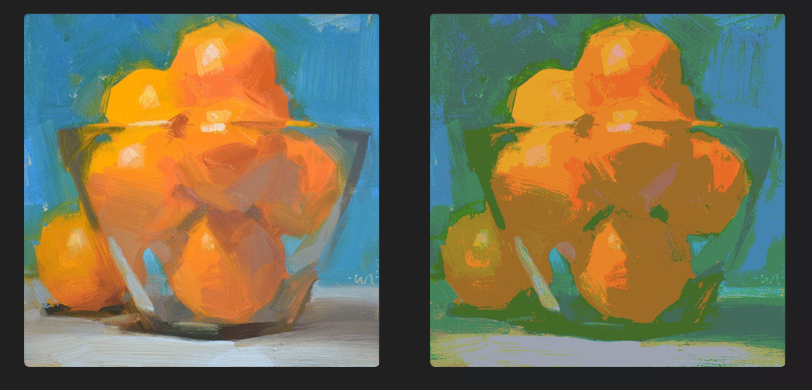

# 图像处理工具

## 介绍

这是一个用于图像处理的工具，提供了以下主要功能：
1. **像素分阶处理**
2. **对比度调整**

这些功能可以帮助你优化和调整图像，以满足不同的视觉需求和应用场景。

尽管 Photoshop 的木刻滤镜也能实现类似的分阶效果，但是我们的图像处理小工具提供了一个更加轻量级的替代方案。对于画师来说，颜色分阶训练几乎是绘画练习中的必经之路。然而，有时画师们在使用其他绘画工具时，同时启动 Photoshop 可能不太方便（例如使用procreate的本人）。此时，我们的小工具可以为你提供一个快速简便的解决方案，后续会发布在个人网站上供大家使用。除此之外，这个色阶处理小工具因为使用了统计学性质的像素阈值计算，所以相比于PS的木刻滤镜，色阶数低的情况下也不会破坏原图的黑白相对关系。

## 功能

### 像素分阶处理

像素分阶处理功能允许你将图像的颜色信息按指定的色阶进行处理。该功能有两种分阶方法：

1. **基于统计规律的分阶**：
   - **描述**：通过统计图像的像素直方图，根据像素的统计规律自动确定色阶的阈值。这种方法根据实际像素的分布情况来选择色阶的区间，从而使得分阶后的图像在视觉上更接近原图。
   - **预览**：以下是使用基于统计规律的分阶处理后的图像预览：
    
    
   
2. **平均分阶**：
   - **描述**：通过将颜色值范围均分为指定的色阶数来处理图像。这种方法将颜色范围均匀地划分成若干区间，适合对图像进行基本的色阶调整。更加接近PS原本的木刻滤镜。
   - **预览**：以下是使用平均分阶处理后的图像预览：
    
    

### 对比度调整

对比度调整功能允许你根据指定的因子调整图像的对比度,参数取值范围是0-无穷，1为原对比度。增加对比度会使图像的亮部更亮、暗部更暗，从而增强视觉冲击力；降低对比度会使图像变得更加平淡，根据需要可以调整色阶化后的图片。

- **描述**：调整图像的对比度可以帮助增强图像的细节或调整图像的整体风格。你可以通过设置对比度因子的值来实现这一功能。
- **预览**：以下是对比度调整后的图像预览：
  

## 代码说明
### main.py
跟一个参数，为处理图片路径
```bash
python main.py orange.png
```


### EqualDistribution_tool.py

`EqualDistribution_tool.py` 脚本用于对图像进行平均分阶处理。该脚本将图像的像素值映射到指定的色阶，使图像的颜色分布更加均匀。

#### 函数解释：

- **`process_image`**：处理图像并应用平均分阶。

#### 参数说明：

- `input_path`：输入图像的文件路径。
- `output_path`：输出图像的文件路径。
- `grayscale`：是否将图像转换为灰度图像（默认为 `False`）。如果为 `True`，图像将被转换为灰度模式。
- `gradation`：色阶数量（默认为 256）。图像的像素值将被映射到指定的色阶数量中。设置较小的值会减少色阶数，从而使图像的颜色范围变得更集中。
  
### StatisticalDistribution_tool.py

`StatisticalDistribution_tool.py` 脚本用于根据图像像素的统计分布自动选择色阶。通过分析图像的像素直方图，这种方法可以更精确地分配色阶，以使图像的视觉效果更接近原图。

#### 函数解释：

- **`segment_histogram_average(hist, bins, cdf, g)`**：
  - 计算并返回图像直方图的分段平均值。
  - `hist`：图像的直方图数组。
  - `bins`：直方图的区间边界。
  - `cdf`：累积分布函数。
  - `g`：色阶数量。

- **`histogram_equalization(channel, gradation)`**：
  - 对图像的单一通道进行统计分阶处理。
  - `channel`：要处理的图像通道数据（二维数组）。
  - `gradation`：色阶数量。

- **`process_image(input_path, output_path, grayscale=False, gradation=256)`**：
  - 处理整个图像并应用统计分阶。
  - `input_path`：输入图像的文件路径。
  - `output_path`：输出图像的文件路径。
  - `grayscale`：是否将图像转换为灰度图像（默认为 `False`）。
  - `gradation`：色阶数量（默认为 256）。

- **`adjust_contrast(input_path, contrast, output_path)`**：
  - 调整图像的对比度。
  - `input_path`：输入图像的文件路径。
  - `contrast`：对比度因子（大于 1 增加对比度，小于 1 降低对比度）。
  - `output_path`：输出图像的文件路径。

## 未来计划

我们计划将此像素分阶处理工具开发成一个网站小工具，使其更加易于使用和访问。敬请期待更多更新和功能的发布！


## 联系方式


感谢使用我的图像处理工具！如有任何问题或建议，请随时与我联系。mezywzy@126.com
